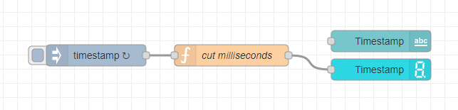

# node-red-contrib-ui-digital-display

A digital display, with adjustable number of digits and decimals, for the Node-RED Dashboard.


## Installation

Open Node-RED and select `Manage palette` from the menu to open the Palette Manager. Go to the `Install` tab, search for `node-red-contrib-ui-digital-display` and click `install`.

Alternatively, you can run the following command in your Node-RED user directory (typically `~/.node-red`):

```
npm i node-red-contrib-ui-digital-display
```

## Example



```
[{"id":"96135b2b.aa4598","type":"tab","label":"Flow 1","disabled":false,"info":""},{"id":"b0a37ddf.3686b","type":"ui_digital_display","z":"96135b2b.aa4598","name":"Timestamp","group":"42b17a1e.4b9414","order":3,"width":"3","height":"1","digits":"10","decimals":"0","x":770,"y":180,"wires":[]},{"id":"6292c6cd.9cc168","type":"ui_text","z":"96135b2b.aa4598","group":"42b17a1e.4b9414","order":2,"width":"3","height":"1","name":"","label":"Timestamp","format":"{{msg.payload}}","layout":"row-spread","x":770,"y":140,"wires":[]},{"id":"18a60805.7181b8","type":"inject","z":"96135b2b.aa4598","name":"","props":[{"p":"payload"},{"p":"topic","vt":"str"}],"repeat":"1","crontab":"","once":true,"onceDelay":0.1,"topic":"","payload":"","payloadType":"date","x":370,"y":160,"wires":[["9f744ce0.9d1de"]]},{"id":"9f744ce0.9d1de","type":"function","z":"96135b2b.aa4598","name":"cut milliseconds","func":"msg.payload /= 1000;\nreturn msg;","outputs":1,"noerr":0,"initialize":"","finalize":"","x":560,"y":160,"wires":[["b0a37ddf.3686b"]]},{"id":"42b17a1e.4b9414","type":"ui_group","z":"","name":"Clock","tab":"d62e70e1.18023","order":1,"disp":true,"width":"6","collapse":false},{"id":"d62e70e1.18023","type":"ui_tab","z":"","name":"Home","icon":"dashboard","disabled":false,"hidden":false}]
```

## License

[MIT](LICENSE)